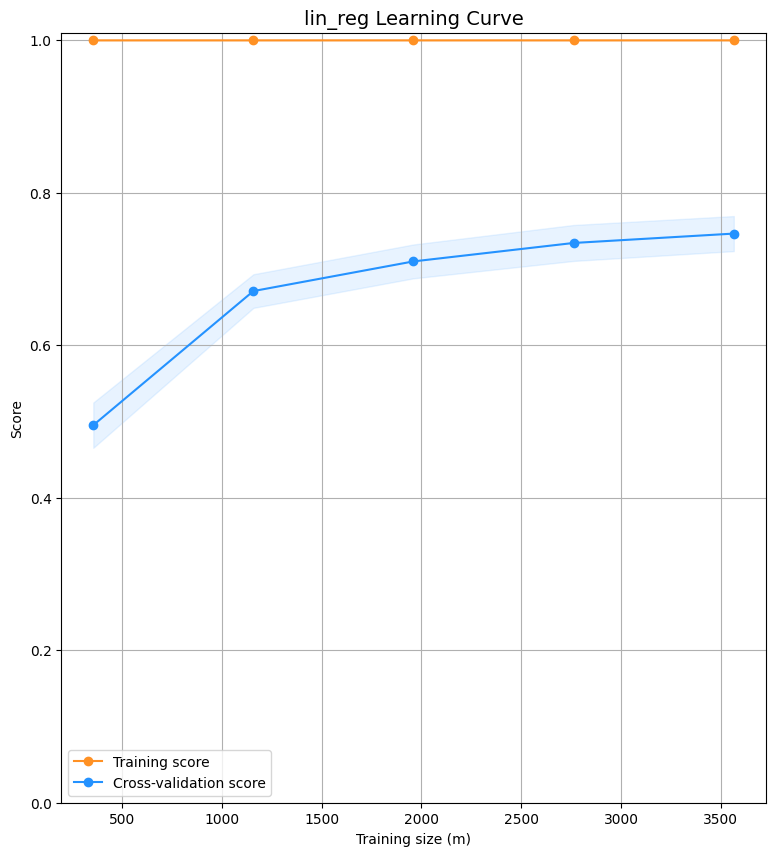
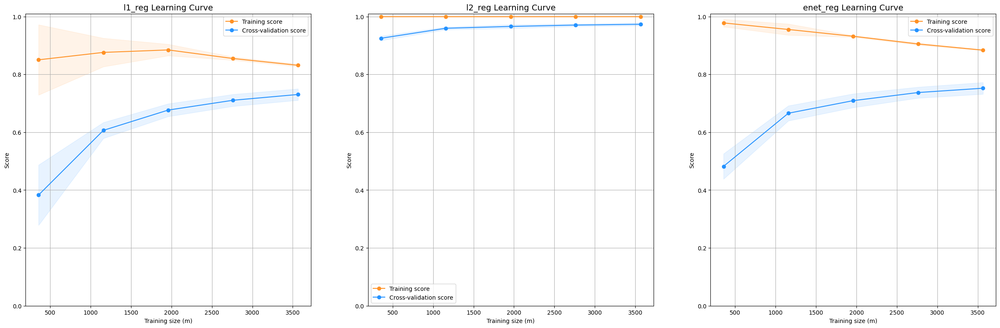
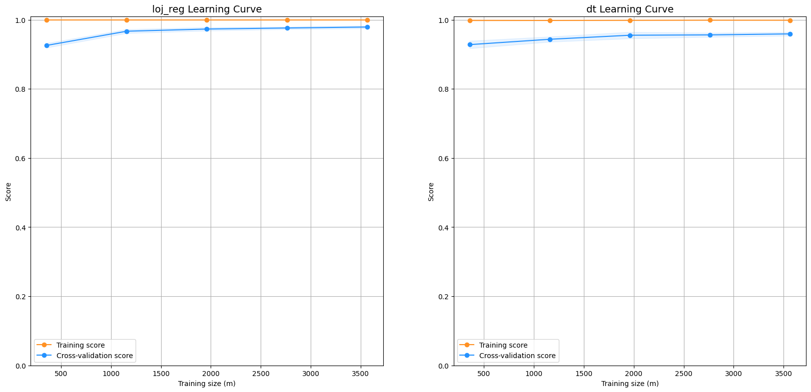
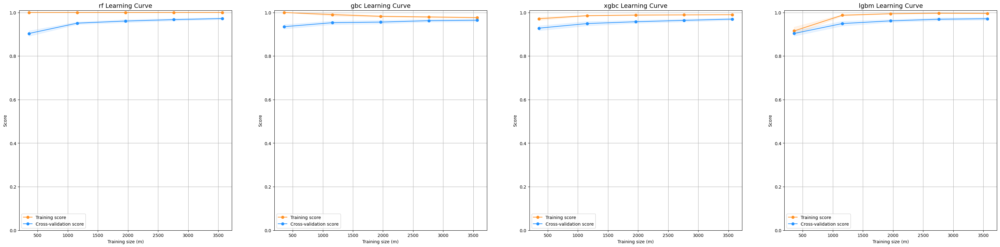

<div style="position: absolute; top: 0; right: 0;">
    <a href="ertugrulbusiness@gmail.com"></a>
    <a href="https://tr.linkedin.com/in/ertu%C4%9Fruldemir?original_referer=https%3A%2F%2Fwww.google.com%2F"></a>
    <a href="https://github.com/ertugruldmr"></a>
    <a href="https://www.kaggle.com/erturuldemir"></a>
    <a href="https://huggingface.co/ErtugrulDemir"></a>
    <a href="https://stackoverflow.com/users/21569249/ertu%c4%9frul-demir?tab=profile"></a>
    <a href="https://medium.com/@ertugrulbusiness"></a>
    <a href="https://www.youtube.com/channel/UCB0_UTu-zbIsoRBHgpsrlsA"></a>
</div>

# SMS Spam Classification
 
## __Table Of Content__
- (A) [__Brief__](#brief)
  - [__Project__](#project)
  - [__Data__](#data)
  - [__Demo__](#demo) -> [Live Demo]()
  - [__Study__](#problemgoal-and-solving-approach) -> [Colab]()
  - [__Results__](#results)
- (B) [__Detailed__](#Details)
  - [__Abstract__](#abstract)
  - [__Explanation of the study__](#explanation-of-the-study)
    - [__(A) Dependencies__](#a-dependencies)
    - [__(B) Dataset__](#b-dataset)
    - [__(C) Modelling__](#c-modelling)
    - [__(D) Deployment as web demo app__](#d-deployment-as-web-demo-app)
  - [__Licance__](#license)
  - [__Connection Links__](#connection-links)

## __Brief__ 

### __Project__ 
- This is an __classification__ of text data  project that uses the [__SMS Spam Collection Dataset__](https://www.kaggle.com/datasets/uciml/sms-spam-collection-dataset) to __classify any SMS__ into spam or not spam class.
- The __goal__ is build a deep learning deep learning model that accurately __classify any sms__ whether a spam sms or not. 
- The performance of the model is evaluated using several __metrics__ loss and accuracy metrics.

#### __Overview__
- This project involves building a deep learning model to classfy the sms texts into whether a spam sms or nto. The SMS Spam Collection is a set of SMS tagged messages that have been collected for SMS Spam research. It contains one set of SMS messages in English of 5,574 messages, tagged acording being ham (legitimate) or spam. The models selected according to model tuning results, the progress optimized respectively the previous tune results. The project uses Python and several popular libraries such as Pandas, NumPy, tensorflow.

#### __Demo__

<div align="left">
  <table>
    <tr>
    <td>
        <a target="_blank" href="" height="30">[Demo app] HF Space</a>
      </td>
      <td>
        <a target="_blank" href="">[Demo app] Run in Colab</a>
      </td>
      <td>
        <a target="_blank" href="">[Traning pipeline] source on GitHub</a>
      </td>
    <td>
        <a target="_blank" href="">[Traning pipeline] Run in Colab</a>
      </td>
    </tr>
  </table>
</div>


- Description
    - __classfy a sms text__ whether spam or not.
    - __Usage__: write a sms then use the button to classfy the sms text.
- Embedded [Demo]() window from HuggingFace Space
    

<iframe
	src=""
	frameborder="0"
	width="850"
	height="450"
></iframe>

#### __Data__
- The [__SMS Spam Collection Dataset__](https://www.kaggle.com/datasets/uciml/sms-spam-collection-dataset) from kaggle dataset api.
- The SMS Spam Collection is a set of SMS tagged messages that have been collected for SMS Spam research. 
  - It contains one set of SMS messages in English of 5,574 messages, tagged acording being ham (legitimate) or spam.

#### Problem, Goal and Solving approach
- This is a __text classification__ problem  that uses the  [__SMS Spam Collection Dataset__](https://www.kaggle.com/datasets/uciml/sms-spam-collection-dataset) to __classfy any sms text__.
- The __goal__ is to build a model that accurately __answer question__ from given the context text.
- __Solving approach__ is that using the supervised deep learning models. A custom classifier model has been developed. 

#### Study
The project aimed classify sms texts into spam or not spam class. The study includes following chapters.
- __(A) Dependencies__: Installations and imports of the libraries.
- __(B) Dataset__: Downloading and loading the dataset. Preparing the dataset via tensorflow. Configurating the dataset performance and related pre-processes.
- __(C) Modelling__: It includes following subsections.
  - Archirecture
    - Creating Custon model architecture for classifying the sms texts.
  - Training
    - Declerating the callbacks then training the hugging face model object using the prepared data with determinated hyperparams.
  - Predicting
    - Implementing the model on the example data, inferencing.
  - Evaluating
    - Saving the model architecture with weights.
- __(D) Deployment as web demo app__: Creating Gradio Web app to Demostrate the project.Then Serving the demo via huggingface as live.

#### results
- The final model is __random forest__ classifier model because of the results and less complexity.
  - Selected Model (Random Forest)
    - results
        <table><tr><th> Results </th><th></th></tr><tr><td>
        | model | accuracy | precision | recall | f1_score |
        |-------|----------|-----------|--------|----------|
        | rf    | 0.98296  | 0.98296   | 0.98296| 0.98296  |
      </td></tr></table>
  - Non linear model


## Details

### Abstract
- [__SMS Spam Collection Dataset__](https://www.kaggle.com/datasets/uciml/sms-spam-collection-dataset) is used to classify any sms text into spam or not spam class. The SMS Spam Collection is a set of SMS tagged messages that have been collected for SMS Spam research. It contains one set of SMS messages in English of 5,574 messages, tagged acording being ham (legitimate) or spam.. The problem is a text classification task as natural language problem  The goal is classifying the sms texts whether spam or not using through supervised machine learning model, state of art deep learning algorithms via fine tuning or transfer learning. The study includes creating the environment, getting the data, preprocessing the data, exploring the data, configurating the data, tokenizating the data, adjusting the data notation, preprocesing the data, modelling the data, saving the results, deployment as demo app. Training phase of the models implemented through tensorflow callbacks. After the fine tuning  state of art model traininigs, transfer learning and related approaches are implemented. Selected the basic and more succesful model which is the random forest machine learning algorithm. Fine-Tuned __random forest classifier__  model has __0.98296__ accuracy , __0.98296__ precision, __0.98296__ recall, __0.98296__ f1_score  other metrics are also found the results section. Created a demo at the demo app section and served on huggingface space.  


### File Structures

- File Structure Tree
```bash
├── demo_app
│   ├── app.py
│   ├── requirements.txt
│   ├── rf_model.sav
│   ├── tfidf_transformer
│   └── vectorizer
├── docs
│   └── images
├── env
│   ├── env_installation.md
│   └── requirements.txt
├── LICENSE
├── readme.md
└── study.ipynb
```
- Description of the files
  - demo_app/
    - Includes the demo web app files, it has the all the requirements in the folder so it can serve on anywhere.
  - demo_app/rf_model.sav
    - random forest classifier as sklearn model object for text classification task.
  - demo_app/requirements.txt
    - It includes the dependencies of the demo_app.
  - demo_app/tfidf_transformer
    - Feature extraction transformer from text which uses tfidf calculation approach.
  - demo_app/vectorizer
    - Converting the text data into numerical representation as vector.
  - docs/
    - Includes the documents about results and presentations
  - env/
    - It includes the training environmet related files. these are required when you run the study.ipynb file.
  - LICENSE
    - It is the pure apache 2.0 licence. It isn't edited.
  - readme.md
    - It includes all the explanations about the project
  - study.ipynb
    - It is all the studies about solving the problem which reason of the dataset existance.    

### Explanation of the Study
#### __(A) Dependencies__:
  - The is a third part installation as kaggle dataset api, it can handle easly following the study.ipynb code order, so creating virtual environment is enough. Thse dependencies easly install by following the code in the study.ipynb. You can create an environment via env/requirements.txt. Create a virtual environment then use hte following code. It is enough to satisfy the requirements for runing the study.ipynb which training pipeline.
  - Dataset can download via kaggle dataset api.
#### __(B) Dataset__: 
- The [__SMS Spam Collection Dataset__](https://www.kaggle.com/datasets/uciml/sms-spam-collection-dataset) from kaggle dataset api.
- The SMS Spam Collection is a set of SMS tagged messages that have been collected for SMS Spam research. 
  - It contains one set of SMS messages in English of 5,574 messages, tagged acording being ham (legitimate) or spam.
  - Creating the tensorflow dataset object from dataset which obetained from kaggle dataset api then configurating.
#### __(C) Modelling__: 
  - The processes are below:
    - Archirecture
      - 'distilbert-base-cased' model architecture is used through huggingface TFAutoModelForQuestionAnswering object for natural language processing Question Answering task.
      - Deep learning: Declerating the callbacks then training the model using the prepared data with determinated hyperparams.
      - Machine learning: Model tuning methods has been implemented via cross validation and hyperparameter optimization.
    - Linear Models
      - linear, l1, l2, enet regressions
      - Cross Validation Scores
        | model         | accuracy   | precision  | recall     | f1_score   |
        | -------------|-----------|------------|------------|------------|
        | in_reg        | 0.970404  | 0.970404   | 0.970404   | 0.970404   |
        | l1_reg        | 0.964126  | 0.964126   | 0.964126   | 0.964126   |
        | l2_reg        | 0.980269  | 0.980269   | 0.980269   | 0.980269   |
        | enet_reg      | 0.973094  | 0.973094   | 0.973094   | 0.973094   |
      - Learning Curve
        <div style="display:flex; justify-content: center; align-items:center;">
          
          
        </div>
    - Non-linear Models
      - loj_reg, knn, dt
      - Cross Validation Scores
        | model   | accuracy | precision | recall   | f1_score |
        |---------|----------|-----------|----------|----------|
        | loj_reg | 0.981166 | 0.981166  | 0.981166 | 0.981166 |
        | knn     | 0.925561 | 0.925561  | 0.925561 | 0.925561 |
        | dt      | 0.962332 | 0.962332  | 0.962332 | 0.962332 |
      - Learning Curve
        <div style="display:flex; justify-content: center; align-items:center;">
          
        </div>
    - Ensemble Models
      - rf, gbc, xgbc, lgbm, cb
      - Cross Validation Scores
        | model | accuracy | precision | recall | f1_score |
        |-------|----------|-----------|--------|----------|
        | rf    | 0.98296  | 0.98296   | 0.98296| 0.98296  |
        | gbc   | 0.967713 | 0.967713  | 0.967713| 0.967713 |
        | xgbc  | 0.974888 | 0.974888  | 0.974888| 0.974888 |
        | lgbm  | 0.975785 | 0.975785  | 0.975785| 0.975785 |
        | cb    | 0.98296  | 0.98296   | 0.98296| 0.98296  |
      - Learning Curve
        <div style="display:flex; justify-content: center; align-items:center;">
          
        </div>
  - Saving the project and demo studies.
    - trained model __random forest classifier__ as tensorflow (keras) saved_model format.

#### __(D) Deployment as web demo app__: 
  - Creating Gradio Web app to Demostrate the project.Then Serving the demo via huggingface as live.
  - Desciption
    - Project goal is classifiying the sms text whether spam or not spam.
    - Usage: write a sms text then use the button to classify it.
  - Demo
    - The demo app in the demo_app folder as an individual project. All the requirements and dependencies are in there. You can run it anywhere if you install the requirements.txt.
    - You can find the live demo as huggingface space in this [demo link]() as full web page or you can also us the [embedded demo widget](#demo)  in this document.  
    
## License
- This project is licensed under the Apache 2.0 License. See the [LICENSE](LICENSE) file for details.

<h1 style="text-align: center;">Connection Links</h1>

<div style="text-align: center;">
    <a href="ertugrulbusiness@gmail.com"></a>
    <a href="https://tr.linkedin.com/in/ertu%C4%9Fruldemir?original_referer=https%3A%2F%2Fwww.google.com%2F"></a>
    <a href="https://github.com/ertugruldmr"></a>
    <a href="https://www.kaggle.com/erturuldemir"></a>
    <a href="https://huggingface.co/ErtugrulDemir"></a>
    <a href="https://stackoverflow.com/users/21569249/ertu%c4%9frul-demir?tab=profile"></a>
    <a href="https://www.hackerrank.com/ertugrulbusiness"></a>
    <a href="https://app.patika.dev/ertugruldmr"></a>
    <a href="https://medium.com/@ertugrulbusiness"></a>
    <a href="https://www.youtube.com/channel/UCB0_UTu-zbIsoRBHgpsrlsA"></a>
</div>

